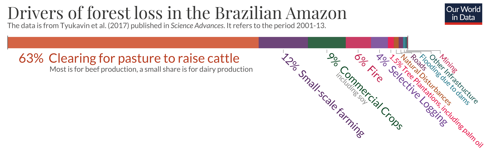
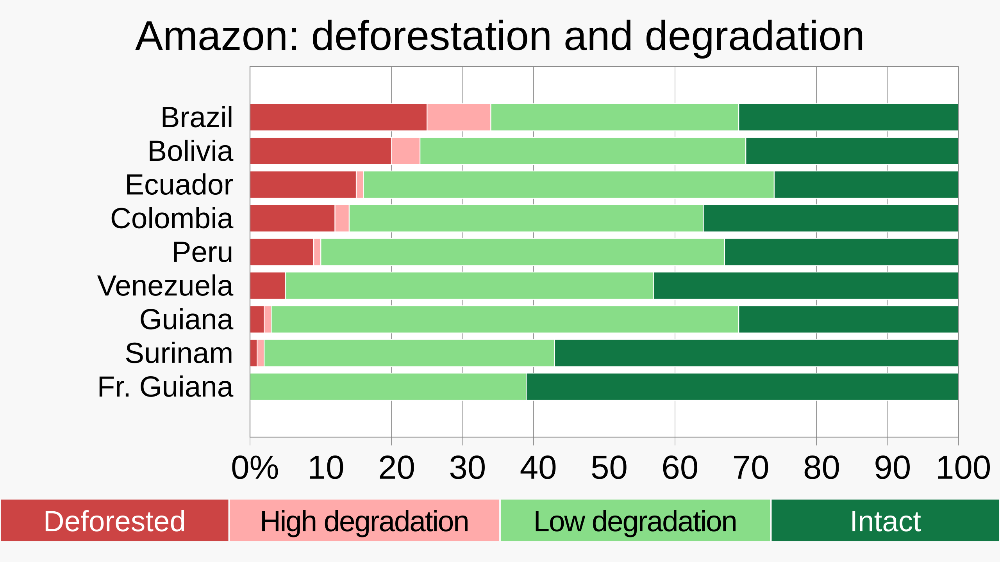
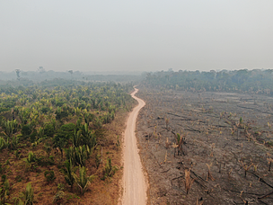

<!-- _class: lead -->
# 🌳 消失的绿色  
## ——巴西亚马逊雨林的呼救  

---
# 如果你看不清
# 请扫码观看
## 或者访问地址
### *slides.aisaka.cc*

---

## 自我介绍

### TingChieh Hu (胡廷杰)

- 23 软件工程转本 2 班
- Flask 自学中……
- 熟练掌握各种 AI 工具
- 我只是个菜鸡 🐔 求求 Dalao 带带我 😭
- 📮 tingchieh77@gmail.com

---

## 1️⃣ 亚马逊雨林简介

- 🌎 世界上最大的热带雨林，覆盖 9 个国家  
- 🇧🇷 **60% 位于巴西境内**  
- 面积约 **550 万平方公里**  
- 被称为 **“地球之肺”**  
- 吸收全球约 **10% 的二氧化碳**

---

## 2️⃣ 雨林正在消失

- 2001–2020 年失去超过 **5420 万公顷森林**（≈法国面积）  
- 2022 年砍伐面积达 **11 568 km²**  
- 2024 年再损失约 **95 万公顷**

📉 森林损失趋势持续，尽管近期略有下降。

---
## 3️⃣ 消失的原因

---

## 3️⃣ 消失的原因

| 排名 | 主要原因 | 百分比 | 说明 |
|:--:|:--|:--:|:--|
| 🥇 | 牧场开垦 (Clearing for pasture) | **63 %** | 主要用于牛肉生产 |
| 🥈 | 小规模农业 (Small-scale farming) | **12 %** | 刀耕火种、小农种植 |
| 🥉 | 商业作物 (Commercial crops) | **9 %** | 大豆、玉米等出口农业 |
| 4 | 火灾 (Fire) | **6 %** | 自然与人为焚烧并存 |
| 5 | 选择性伐木 (Selective logging) | **4 %** | 高价值树种采伐 |

---

## 4️⃣ 环境与生态影响

- 碳吸收能力下降 → 加速气候变暖  
- 水循环紊乱 → 干旱与火灾频发  
- 生物多样性锐减  
- 金狮狨猴、巨嘴鸟、树懒等面临失栖  
- 火灾与烟尘反射阳光，破坏局地气候

---

## 5️⃣ 社会与经济影响

| 方面 | 主要变化 / 现象 | 具体表现 |
|:--|:--|:--|
| **收入与财富分布** | 大豆区农户收入显著提高 | Sorriso 地区平均收入为 Guarantã do Norte 的 约 4.6 倍 |
| **就业结构** | 机械化减少农业劳动力需求 | 每 500 公顷 ≈ 1 名固定工人，但带动运输、机械维修、仓储等服务 |
| **小农地位** | 土地兼并、规模化经营 | 小农被迫出售土地或转为雇工，社会阶层分化加剧 |

---
| 方面 | 主要变化 / 现象 | 具体表现 |
|:--|:--|:--|
| **社会基础设施** | 政府税收增长推动公共服务改善 | 教育、医疗、道路状况提升，生活便利性增强 |
| **劳工权益** | 存在劳动剥削与债务束缚个案 | 非正规雇佣与“债务奴役”仍被报告 |
| **性别与家庭结构** | 女性在农场决策中角色有限 | 机械化减少家庭协作型劳作机会 |
| **社会观感** | 大多数农户对大豆持积极态度 | 认为经济增长带来机会，但担忧生态退化 |
| **区域不平等** | 富裕地区吸引投资、贫困区被边缘化 | 交通与市场基础设施差距扩大 |

---
## 6️⃣ 临界点警告

---

## 6️⃣ 临界点警告

Overall, 20% of the Amazon rainforest has been "transformed" (deforested) and another 6% has been "highly degraded", causing Amazon Watch to warn that the Amazonia is in the midst of a tipping point crisis.
总体而言，亚马逊雨林已有 20% 被「改造」（砍伐），另有 6% 受到「严重退化」，导致亚马逊观察组织警告称亚马逊地区正面临临界点危机。

> 生态系统临界点是指：当环境压力累积到一定程度后，生态系统会发生突然、不可逆的结构性转变，即从一种稳定状态跃迁到另一种状态。

---

### 7️⃣ 变化与努力

#### 📉 森林变化趋势

- 2000年代初期毁林率高峰 2004 年达 **27,423 km²/年**  
- 2009–2012年显著下降 得益于监测与政策干预  
- 2017–2018年回升至 **7,900 km²/年**  
- 近年（2023）再次下降 **约55–60%** 新政府加强监管、恢复亚马逊基金  
- 然而，局部地区已**接近生态临界点**森林退化、干旱、火灾频发  

---

### 🛠️ 保护与恢复努力

| 措施 | 内容 | 成效 |
|:--|:--|:--|
| **亚马逊基金** | 挪威、德国等资助保护项目 | 支持上千个地方项目 |
| **土地确权** | 原住民土地登记与保护 | 被确权区域毁林率降 75% |
| **Soy Moratorium** | 禁止购买非法毁林地大豆 | 显著减少亚马逊区直接毁林 |
| **遥感监测与执法** | 卫星系统 + 警方打击非法伐木 | 提升追踪效率、威慑力增强 |
| **国际合作** | COP26 承诺2030年终止全球毁林 | 覆盖全球 85% 森林地区 |

---

## 🌿 结语

> “守护亚马逊，就是守护我们共同的未来。”

- 我们能做的每一个小行动  
  都可能成为改变地球命运的种子 🌱

---

# **最后的最后** 

- 单词记忆网站（我让 AI 造的 😁）
- 求求你们用用，我需要改进意见 🥺

---

# **Q&A 环节**

#### 当然我能解答还是可以问 😁

---

## 📚 参考资料与数据来源

> 以下数据与图像来自公开可查的科研机构、新闻与环保组织报告：

- 🌎 **WWF（世界自然基金会）**  
  *Deforestation in the Amazon remains at high levels (2022)*  
  https://www.wwf.org.br

- 🛰️ **NASA Earth Observatory**  
  *World of Change: Amazon Deforestation*  
  https://earthobservatory.nasa.gov

- 📊 **InfoAmazonia / Amazon Conservation**  
  *Deforestation in the Amazon: Past, Present and Future (2023)*  
  https://infoamazonia.org / https://amazonconservation.org

---

- 🗺️ **Wikipedia / Global Landscape Forum / WRI**  
  *Deforestation of the Amazon Rainforest*, *Nature Crime in the Amazon*  
  https://en.wikipedia.org/wiki/Deforestation_of_the_Amazon_rainforest  
  https://thinklandscape.globallandscapesforum.org  
  https://www.wri.org/insights

- 📰 **AP News / Le Monde / Argus Media**  
  *Brazil’s Amazon deforestation falls 11% even as fires surge* (2024)  
  *How healthy is the Amazon, the world’s largest tropical rainforest?* (2025)

---

- 🎓 **National Geographic Education**  
  *Amazon Deforestation and Climate Change*  
  https://education.nationalgeographic.org/resource/amazon-deforestation-and-climate-change/

---

### 💫 感谢聆听  
#### Powered by Marp  
#### Thanks for Watching 🌎

